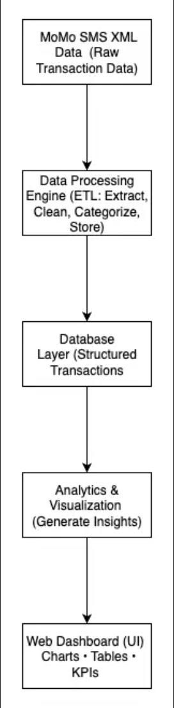

# 📊 MoMo Transaction Dashboard

## 🧩 G-Ten 
## 👥 Team Members  
- Mbanza Teta Darcy  
- Aderline Gashugi 
- Henriette Biziyaremye 
- David Shumbusho

---

## 📌 Project Description  
This project processes **MoMo SMS transaction data** in XML format, cleans and categorizes it, stores it in a relational database, and provides a **web-based dashboard** to analyze and visualize transaction insights.  

---

## 🏛️ System Architecture  
We use an **ETL pipeline** to extract, transform, and load data into a database. The cleaned data is then used to generate analytics and visualizations on a simple dashboard.

**Architecture Diagram:**  
[🔗 View Diagram](<https://drive.google.com/file/d/13LnY_zU2YuJpSjdtIuyehOeo5_XLI9GL/view?usp=sharing>)

---

## 📌 Scrum Board  
We are following **Agile** practices to organize and manage tasks using a Scrum board.

**Scrum Board Link:**  
[🔗 View Scrum Board](https://trello.com/b/915F2Fcc)

